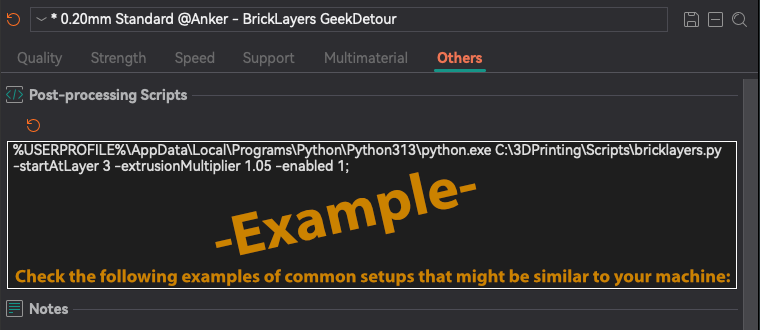

# Bricklayers
Interlocking Layers Post-Processing Script for PrusaSlicer, OrcaSlicer, and BambuStudio

## Video about this script:
[](https://www.youtube.com/watch?v=qqJOa46OTTs)

---

## Install Python or Pypy
To use the script, you need **Python 3** installed in your machine:
- [Download Python 3](https://www.python.org/downloads/) CPython, or
- [Download PyPy 3](https://pypy.org/download.html) PYPY (faster)

---

## Setup in your Slicer
Edit the **"Post processing scripts"** section in your slicer.



**Make sure to update the path** to match:
- Your **Python installation** folder.
- The folder where **you saved `bricklayers.py`**.

### **Windows Examples 🖥️**
- Normal Python (CPython):<br>
```%USERPROFILE%\AppData\Local\Programs\Python\Python313\python.exe C:\3DPrinting\Scripts\bricklayers.py -startAtLayer 3 -extrusionMultiplier 1.05 -enabled 1;```
- PYPY3:<br>
```C:\3DPrinting\pypy3.11-v7.3.19-win64\pypy3.exe C:\3DPrinting\Scripts\bricklayers.py -startAtLayer 3 -extrusionMultiplier 1.05 -enabled 1;```

### **Mac/Linux Examples 🍏 🐧**
- CPython (installed globally):<br>
```/usr/local/bin/python3 /Volumes/3DPrinting/Scripts/bricklayers.py -startAtLayer 3 -extrusionMultiplier 1.05 -enabled 1;```
- CPython (installed locally):<br>
```/Users/YourName/.pyenv/shims/python3 /Volumes/3DPrinting/Scripts/bricklayers.py -startAtLayer 3 -extrusionMultiplier 1.05 -enabled 1;```
- PyPy3 (installed globally):<br>
```/usr/local/bin/pypy3 /Volumes/3DPrinting/Scripts/bricklayers.py -startAtLayer 3 -extrusionMultiplier 1.05 -enabled 1;```
- PyPy3 (installed locally):<br>
```/Users/YourName/.pyenv/versions/pypy3/bin/pypy3 /Volumes/3DPrinting/Scripts/bricklayers.py -startAtLayer 3 -extrusionMultiplier 1.05 -enabled 1;```

**PrusaSlicer Users:**
You **must disable** `"Supports binary G-code"` in **Printers → General → Firmware** (Expert Mode) 
The Binary G-code format is incompatible with post-processing scripts.

---

## Command Line Interface
You can use the script to modify GCode files outside of the slicer.
First, I recommend you to check 2 examples in this file:
https://github.com/GeekDetour/BrickLayers/blob/main/sample_tests/simpletest.sh

Try running it once, as provided.

If you downloaded or cloned the repository, in your Terminal, go to the repository and:
```sh
cd sample_tests
chmod +x simpletest.sh
./simpletest.sh
```

You should see something like this:


---

## Features
**Automatically detects Layer Height and Retraction settings**.

**Detailed instructions in the next hours. Thanks for your patience.**

